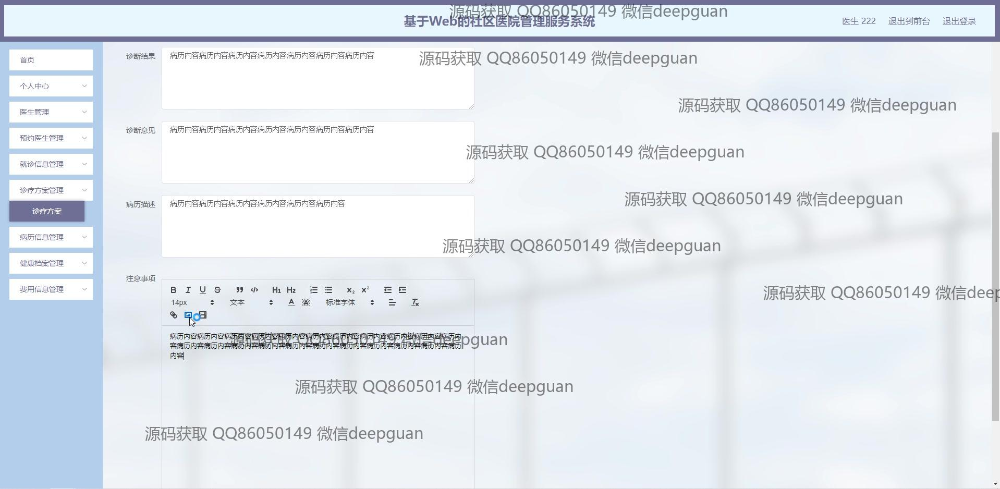
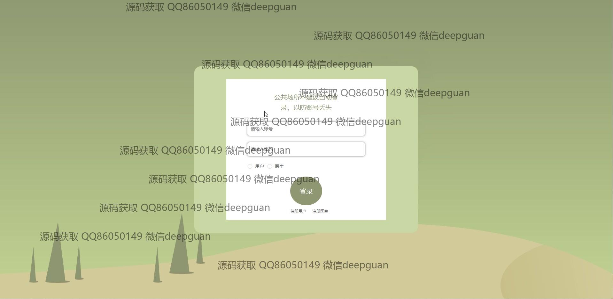

<h1 align="center">基于Web的社区医院管理服务系统</h1>

## 简介
基于Web的社区医院管理服务系统，角色分为管理员和用户；功能涵盖医生管理、患者管理、预约管理、诊疗方案管理、病历信息管理、健康档案管理和费用信息管理，提供高效的医院信息管理解决方案。    --计算机毕业设计源码；毕设源码；java毕业设计源码

## 联系方式

<h3 align="center">获取完整代码与数据库文件 + 微信：deepguan QQ: 86050149 QQ群: 783742310</h3>

<h3 align="center">可帮忙远程部署 包运行成功！提供远程部署、修改代码、设计文档指导、代码讲解等服务！</h3>

## 功能介绍（完整见运行截图）
管理员：
基本功能包括登录、退出、用户注册和查看修改个人信息。系统首页提供导航栏，包括医生管理、预约管理、用户管理、公告信息管理等主要模块。管理员可以进行医生信息的录入与查询、管理预约安排与就诊信息、发布和管理公告资讯。用户管理方面，管理员负责查看、修改或删除用户信息，确保系统数据的完整性与安全性。同时，还提供费用信息管理，通过新增、查询、修改和删除来管理医院的财务信息。

医生：
医生登录后可以访问个人中心、查看修改个人信息，包括上传头像等功能。系统提供医生管理模块，支持医生注册、登陆及退出等基本操作。医生能查看预约信息，查看患者详细资料，比如病历信息、健康档案、费用信息等。医生可以在诊疗方案模块中录入诊断结果、治疗建议和患者诊疗注意事项，这些信息均可以随时查询和更新。医生管理模块给予医生灵活安排和管理自己与患者的预约及诊疗计划。

用户（患者）：
用户可以通过注册、登录访问系统，进入个人中心，查看和修改个人信息。系统允许用户查看和管理预约信息，包括预约医生、检查就诊时间和诊疗方案等功能。用户能够查询和查看病历及健康档案，更新个人健康信息。同时，用户可在系统中查询医生的相关资料和安排，进行有效预约。个人中心帮助用户查看个人与医院的交互信息，包括费用信息以及支付记录。

系统（综合性功能）：
系统基于Spring Boot开发，设计直观简洁，左侧是功能模块菜单，响应快速，为用户、医生和管理员提供全面的医院管理功能模块。社区医院管理系统包含医生管理、预约与就诊信息管理、费用信息管理等诸多模块结构，实现信息化、智能化的医院管理。系统支持富文本编辑，允许公告编辑，支持公告信息、预约安排等功能，提升工作效率，更好支持医院整体运营。

## 运行截图

本代码来源于网络,仅供学习参考使用!

